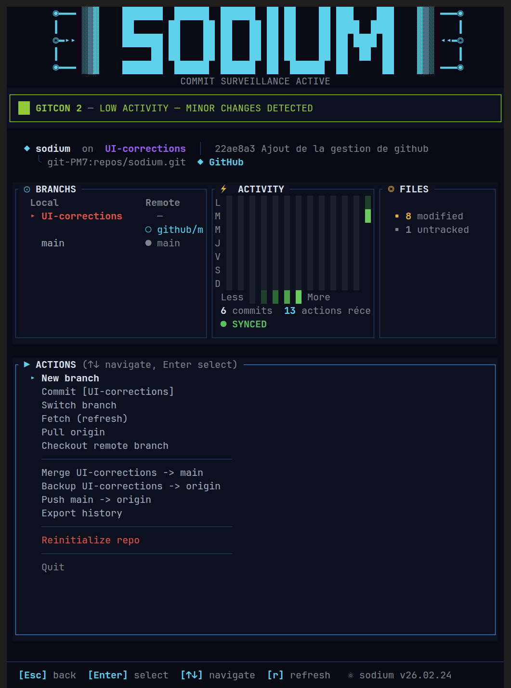

# Sodium

**Git TUI dashboard — dark ops style**

Sodium remplace les commandes git manuelles par une interface visuelle dans le terminal, avec gestion multi-projets et un theme dark-ops inspire des consoles de surveillance.



## Features

- **Multi-projets** — vue d'ensemble de tous vos repos dans `~/dev`
- **Commit interactif** — review des fichiers avec stats de diff, selection manuelle ou globale
- **Branches** — creation, switch, checkout remote, merge dans main
- **Push / Backup** — push main ou sauvegarde de feature branches vers origin
- **Miroir GitHub** — push automatique vers un 2e remote GitHub (configurable par projet)
- **GITCON** — indicateur d'alerte visuel sur l'etat du repo (inspire du systeme DEFCON)
- **Heatmap d'activite** — grille commits/merges/pulls sur 91 jours
- **Export historique** — generation d'un rapport Markdown
- **Reinitialisation** — reset complet d'un repo avec generation automatique du `.gitignore`

## Installation

```bash
# Prerequis : Rust/Cargo, Git, outils de compilation C
# Linux : sudo apt install build-essential pkg-config libssl-dev cmake
# macOS : xcode-select --install

git clone https://github.com/d6soft/sodium.git
cd sodium
cargo build --release
./target/release/sodium
```

## Configuration

Au premier lancement, Sodium cree `~/.config/sodium/sodium.toml` :

```toml
dev_root = "~/dev"
remote_host = "git-PM7"
remote_path = "repos"
pull_rebase = true

# Miroir GitHub (optionnel, par projet)
[projects.sodium]
github = "git@github.com:d6soft/sodium.git"
```

## Documentation

Voir [SODIUM-USER-GUIDE.md](SODIUM-USER-GUIDE.md) pour le guide complet.

## Stack

- **Rust** avec [ratatui](https://github.com/ratatui/ratatui) pour le TUI
- **git2** (libgit2) pour les operations Git natives
- **crossterm** pour le rendu terminal cross-platform

## Licence

Usage personnel.
